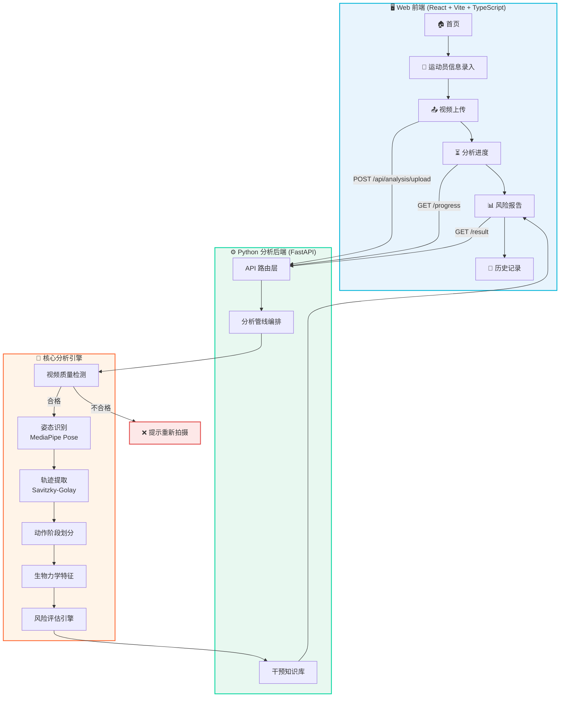
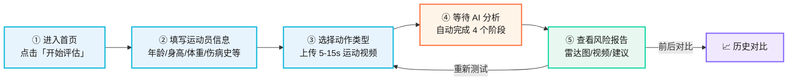
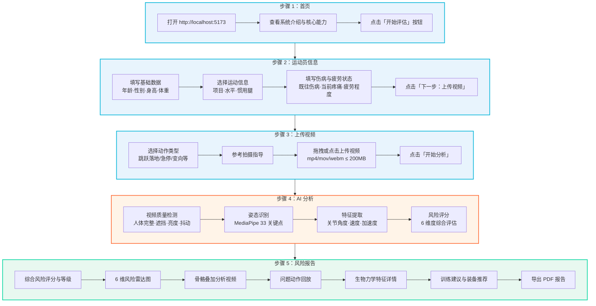
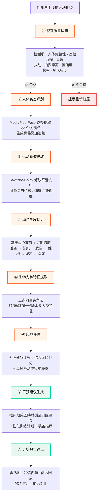
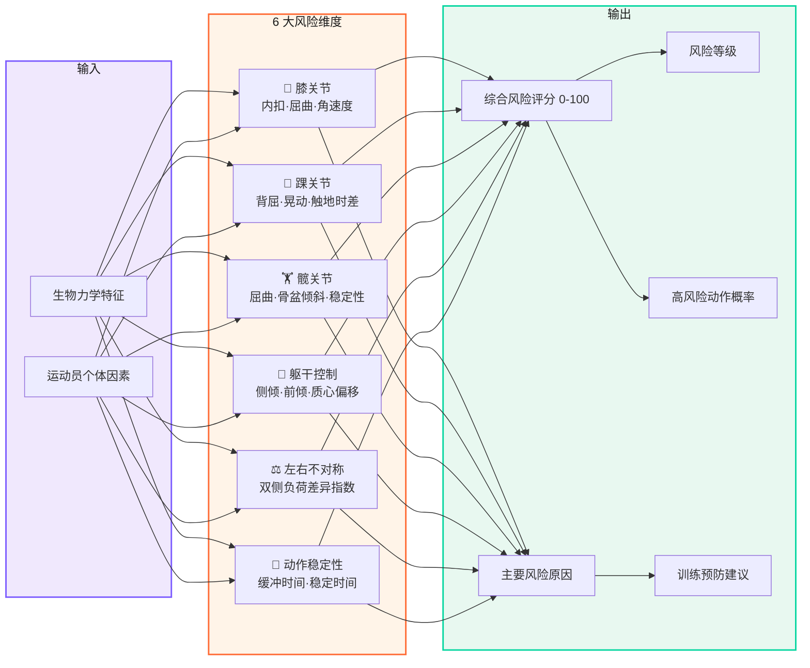
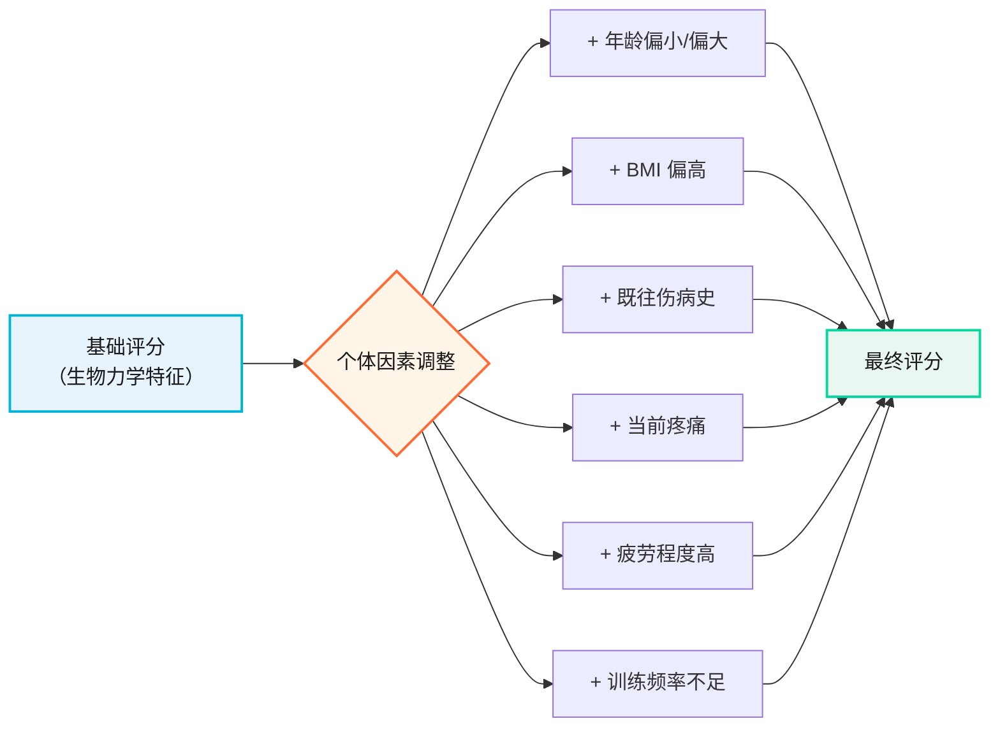
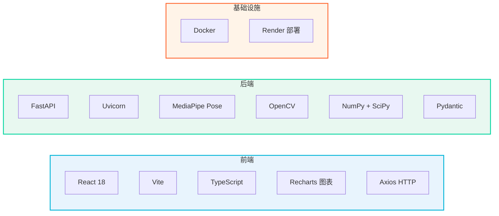
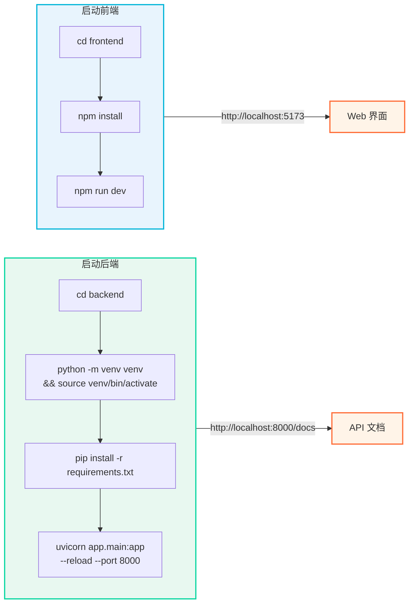
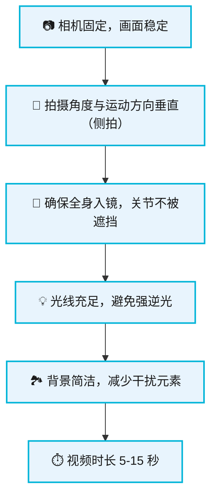
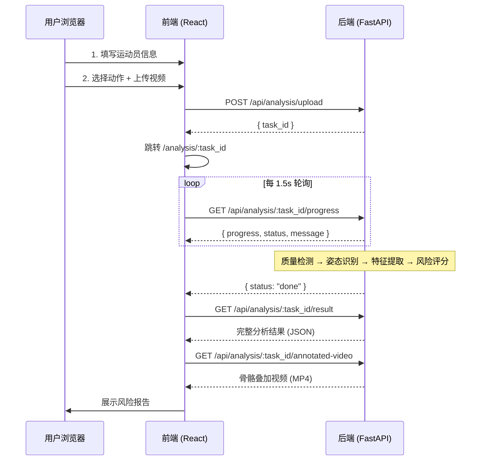

# 🏀 基于计算机视觉的篮球运动损伤风险评估系统

> 通过普通摄像头/手机拍摄运动视频，利用人体姿态识别、运动轨迹分析、运动生物力学特征提取和风险评分模型，识别运动过程中潜在的高风险动作模式，给出风险等级、主要风险原因与针对性预防训练建议。

面向篮球运动中的**跳跃落地、单脚落地、急停、变向**动作，重点评估下肢运动损伤风险。

---

## ⚠️ 重要声明

本系统输出的是 **"高风险动作模式概率"** 与 **"运动损伤风险评分"**，**不是医学诊断结果**，也不直接等同于运动员未来真实发生伤病的概率。风险评估基于生物力学特征与启发式阈值规则，仅用于动作模式筛查与训练参考。

---

## 📌 目录

- [系统架构](#系统架构)
- [用户操作流程](#用户操作流程)
- [AI 分析管线](#ai-分析管线)
- [风险评估模型](#风险评估模型)
- [技术栈](#技术栈)
- [快速开始](#快速开始)
- [API 接口](#api-接口)
- [目录结构](#目录结构)
- [操作演示](#操作演示)
- [局限性与未来工作](#局限性与未来工作)

---

## 系统架构



## 用户操作流程

> 从打开系统到获取风险报告，完整操作只需 **5 步**：



### 各步骤详细说明



## AI 分析管线

> 视频上传后，后端自动执行以下 **8 步分析管线**，全程无需人工干预：



## 风险评估模型

> 从 6 个维度综合评估下肢运动损伤风险，每个维度独立评分后加权汇总：



### 风险等级划分

| 等级 | 评分范围 | 含义 |
|---|---|---|
| 🟢 低风险 | < 35 | 动作模式良好，维持现有训练 |
| 🟡 中风险 | 35 - 65 | 存在风险因素，建议针对性纠正训练 |
| 🔴 高风险 | > 65 | 高风险动作模式明显，需立即干预 |

### 个体因素影响

系统会根据运动员的个体因素对基础评分进行动态调整：



## 技术栈



| 模块 | 技术方案 | 说明 |
|---|---|---|
| Web 前端 | React 18 + Vite + TypeScript | 9 个页面，含风险雷达图、骨骼叠加视频、特征可视化 |
| 视频后端 | FastAPI + Uvicorn | 异步 API，任务式分析管线 |
| 姿态识别 | MediaPipe Pose | 逐帧提取 33 个关键点，生成骨骼叠加视频 |
| 轨迹分析 | Savitzky-Golay 滤波 | 关节位移/速度/加速度/平滑去抖 |
| 动作阶段 | 重心高度 + 足部速度 | 准备/起跳/腾空/触地/缓冲/稳定 |
| 生物力学 | 三点向量夹角法 | 膝/髋/踝/躯干/整体 5 大类特征 |
| 风险评估 | 启发式阈值规则引擎 | 0-100 评分 + 6 维分项 + 风险等级 |
| 干预知识库 | 结构化规则库 | 按风险成因映射循证训练建议 |

## 快速开始

### 环境要求

- Python 3.10+
- Node.js 18+

### 方式一：一键启动（macOS）

双击 `篮球分析系统.command` 文件即可自动启动前后端并打开浏览器。

### 方式二：手动启动



**启动后端：**
```bash
cd backend
python -m venv venv && source venv/bin/activate   # Windows: venv\Scripts\activate
pip install -r requirements.txt
uvicorn app.main:app --reload --port 8000
```
后端启动后访问 http://localhost:8000/docs 查看 API 文档。

**启动前端：**
```bash
cd frontend
npm install
npm run dev
```
前端启动后访问 http://localhost:5173。

### 拍摄指导



## API 接口



| 方法 | 路径 | 说明 |
|---|---|---|
| POST | `/api/analysis/upload` | 上传视频+运动员信息，启动分析，返回 task_id |
| GET | `/api/analysis/{task_id}/progress` | 轮询分析进度 |
| GET | `/api/analysis/{task_id}/result` | 获取完整分析结果 |
| GET | `/api/analysis/{task_id}/annotated-video` | 获取带骨骼叠加的 mp4 |
| GET | `/api/analysis/{task_id}/problem-moment/{clip_index}/video` | 获取问题动作片段视频 |
| GET | `/api/analysis/{task_id}/pdf` | 导出 PDF 报告 |
| GET | `/api/analysis/{task_id}/timeline` | 逐帧特征时间序列 |
| GET | `/api/analysis/history` | 历史分析记录 |
| GET | `/api/meta/actions` | 支持的动作列表 |
| GET | `/api/meta/guide` | 拍摄指导要点 |

## 目录结构

```
.
├── backend/                     # Python 分析后端
│   ├── app/
│   │   ├── main.py              # FastAPI 入口
│   │   ├── config.py            # 配置(阈值/路径/CORS)
│   │   ├── api/analysis.py      # API 路由
│   │   ├── core/                # 核心分析模块
│   │   │   ├── pose_estimation.py    # 姿态识别(MediaPipe)
│   │   │   ├── trajectory.py         # 轨迹提取与平滑
│   │   │   ├── phase_detection.py    # 动作阶段识别
│   │   │   ├── biomechanics.py       # 生物力学特征提取
│   │   │   ├── risk_assessment.py    # 风险评估引擎
│   │   │   ├── video_quality.py      # 视频质量检测
│   │   │   ├── evidence.py           # 学术依据
│   │   │   ├── pdf_generator.py      # PDF 报告生成
│   │   │   └── pipeline.py           # 分析编排管线
│   │   ├── knowledge/intervention.py # 干预措施知识库
│   │   └── models/schemas.py    # 数据模型契约(Pydantic)
│   ├── data/                    # 上传/结果/样本
│   ├── scripts/                 # 工具脚本
│   ├── tests/                   # 测试
│   ├── requirements.txt
│   ├── Dockerfile
│   └── render.yaml
├── frontend/                    # React 前端
│   ├── src/
│   │   ├── pages/               # 9 个页面
│   │   │   ├── Home.tsx             # 首页
│   │   │   ├── Athlete.tsx          # 运动员信息录入
│   │   │   ├── Upload.tsx           # 视频上传
│   │   │   ├── Analysis.tsx         # 分析进度
│   │   │   ├── Report.tsx           # 风险报告
│   │   │   ├── History.tsx          # 历史记录
│   │   │   ├── About.tsx            # 关于
│   │   │   ├── Methodology.tsx      # 方法论
│   │   │   └── MLPredict.tsx        # ML 预测
│   │   ├── components/          # 布局/导航/页脚
│   │   ├── services/api.ts      # API 封装
│   │   ├── types/index.ts       # 类型定义
│   │   └── utils/index.ts       # 工具函数
│   ├── package.json
│   └── vite.config.ts
├── 篮球分析系统.command           # macOS 一键启动脚本
├── start_servers.sh             # 服务器启动脚本
├── stop_servers.sh              # 服务器停止脚本
├── keepalive.sh                 # 保活脚本
└── README.md
```

## 操作演示

> 系统操作流程动画演示，展示从首页到生成风险报告的完整过程（自动循环播放，正确渲染中文）。

🖥️ **[在线查看动画演示](./docs/demo.html)**

<details>
<summary>📋 演示内容说明</summary>

动画依次展示 5 个界面，每个界面约 4-6 秒，自动循环：

1. **首页** — 系统标题与「开始评估」入口
2. **运动员信息录入** — 姓名 / 年龄 / 身高 / 体重 / 运动项目 / 伤病史，字段逐个填充
3. **视频上传** — 拖拽上传区 + 动作类型选择（投篮 / 运球 / 跳跃 / 变向）
4. **AI 分析中** — 圆形进度环 0→100%，4 阶段依次完成（视频预处理→姿态识别→动作分析→风险评估）
5. **评估报告** — 六维雷达图展开 + 风险等级卡片（高 / 中 / 低）+ MediaPipe 骨架追踪演示

</details>

## 局限性与未来工作

- 当前风险评分为启发式规则，非基于真实伤病随访数据训练的预测模型
- 姿态识别为 2D 近似，部分三维特征(如真实膝外翻)精度有限
- 首版聚焦篮球跳跃落地类动作，急停/变向的生物力学模型待细化
- 未来可接入多机位/深度摄像头提升 3D 精度，并积累纵向数据训练真实预测模型

## 许可

本项目为学术演示用途。
